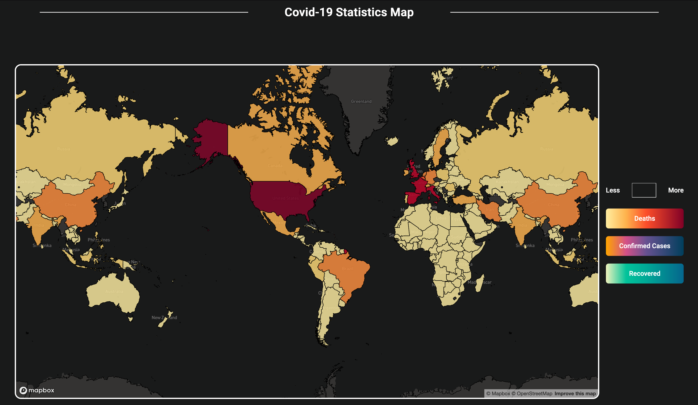
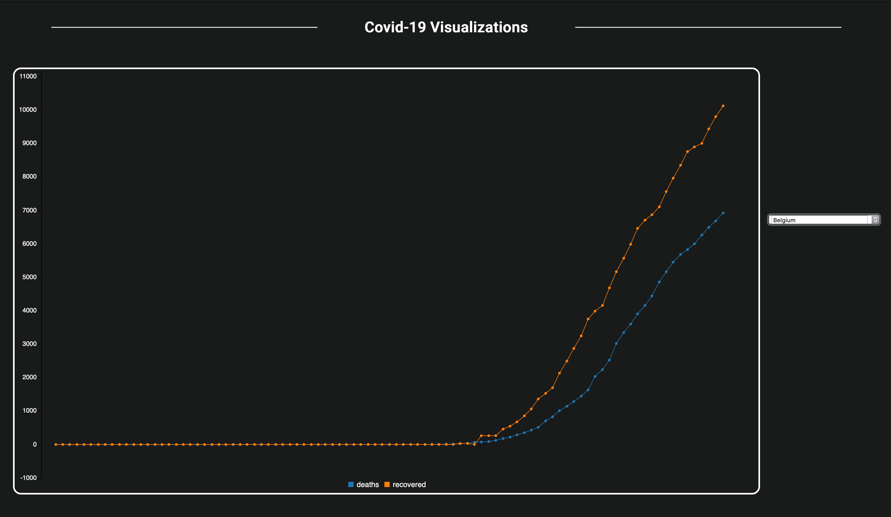

# Projects

This is repository meant to showcase my projects! This read will give a short description of each project and what it does. 

# Covid_19 Data Website

A simple, one page website that utilizes two sections to showcase data about the Covid_19 pandemic. The first section uses a mapbox to color each country individual based on color scale that links to the total deaths, recovered, and confirmed cases numbers grab from this [github](https://pomber.github.io/covid19/timeseries.json) json. The second section uses a multi-line graph to give the user a day-to-day view of each countries death and recovered numbers.

Built on a team with [Justice Suh](https://github.com/justicesuh).

## Libraries Used:

* [Mapbox](https://www.mapbox.com/) - Generates the world map.
* [C3](https://c3js.org/) - Generates the multi-line graph.
* [jQuery](https://jquery.com/) - Useful javascript library.

### Section 1

### Section 2

# 15 Square Puzzle

A purely javascript powered 15 square puzzel game.

### Screenshot -

